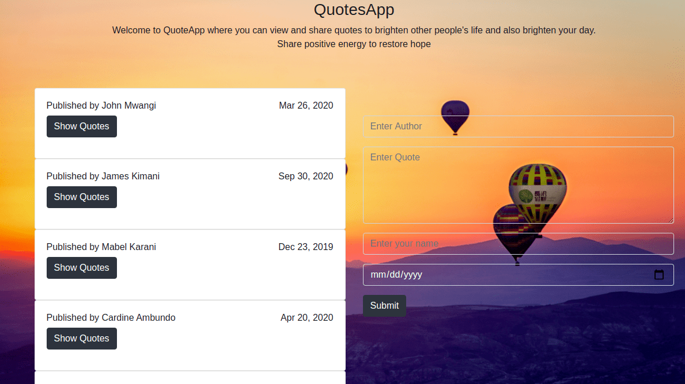

# Quotes App

This a project made using angular which a user can share and also view quotes by other users.The app then updates the quotes once the user submits through the input field.The quotes output shows the user who has published the quote and the date of publish the quote and the author of the quote.The link to the site is [here](https://tomito26.github.io/QuotesApp/)


## Author

- Thomas Khaemba

## Project Setup

This project is accessible on github.Copy the [repository](https://github.com/tomito26/QuotesApp.git) and set it to your local machine by following the steps below.
Open your terminal and paste the link.

```
$ git clone <repo-link>
```

then go to the directory/folder of the project you just cloned

```
$ cd Directory
```

You then type [code .]() for Vs code or [atom .]() for atom IDE

```
code .
```

## Contribution

You can contribute by forking the project and cloning it to your local machine and following the above steps

## Technologies Used

- Angular
- Typescript
- html

## Support and Contact

If you run into any challenge in setting up the project feel free to contact me tommybwah@gmail.com

## License and Copyright

Licensed under [MIT licence](https://choosealicense.com/licenses/mit/)
